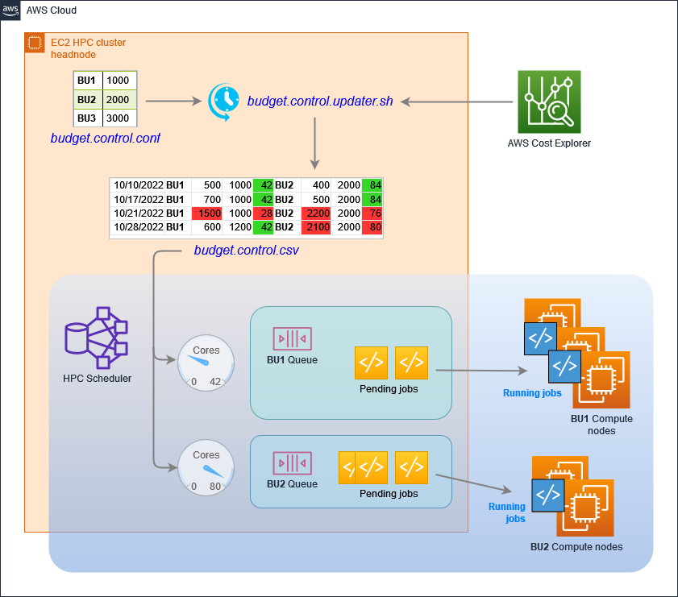

# Dynamic EC2 budget control

**Trademark notices:**
Altair®, PBS® and OpenPBS® are trademarks or registered trademarks of Altair Engineering.
Slurm® and SchedMD® are registered trademarks of SchedMD LLC.
IBM® Platform® LSF® are trademarks or registered trademarks of International Business Machines Corporation in the United States and other countries.

# Summary

HPC customers might want to add a dynamic control of their business units (BU) EC2 compute budgets.
A service like [AWS Budgets](https://aws.amazon.com/aws-cost-management/aws-budgets/) might be too coarse-grained, i.e. not have the necessary insights to track usage and costs details up to each single HPC job, lack flexibility or prompt adaptation to the cluster load.

The solution presented aims to have a **dynamic EC2 cores allocation limit for each business unit** (BU), automatically adapted according to a past time frame (e.g. one week) spending. 

**EC2 cores allocation limit is enforced in the HPC workload scheduler itself, with the use of its dynamic resources.** HPC **jobs breaking the limit will be kept in queue/pending** status until more cores are released by completed, older jobs. Pending reason is also provided by the scheduler, so both business or job owners are aware of the situation.

**Focus is on real EC2 cores** instead of vCPUs, because most HPC applications run better with hyperthreading disabled. HPC users are more familiar with the core concept too.

# Overview of the solution

The underlying core logic is simple**: adapt the scheduler EC2 cores limit for each business unit on a regular basis (e.g. weekly), according to its assigned budget**. 
To calculate past costs, we’ll make use of [**AWS Cost Explorer**](https://aws.amazon.com/aws-cost-management/aws-cost-explorer/).

In this document, we’ll refer to a Linux HPC environment with *weekly* budgets set by Administrators. This time frame, however, can be easily modified since it’s just up to e.g. a system *[cron](https://en.wikipedia.org/wiki/Cron)* setting.

The overall logic is the following:

1. **A configuration file**, located in the HPC headnode, stores the following list of entries defined by Administrators/budget owners:
    `<BU1>,<BU1 weekly budget>
    <BU2>,<BU2 weekly budget>`
    Where `BU1`, `BU2` are business units identifiers or labels. They are next to their respective weekly budget, comma separated. This file can be modified anytime by Administrators/budget owners in case of justified workload spikes or business decisions
2. **A script executed on a weekly basis** (e.g. Sunday at midnight) on the HPC headnode, reads the configuration file, queries AWS Cost Explorer and appends a new row to a CSV file (e.g. *budget.control.csv*) with these contents:
    `date, BU1, BU1 cost, BU1 budget, BU1 core limit, BU2, BU2 cost, BU2 budget, BU2 core limit,...` 
    where:
    1. `date` reports the day/timestamp this row has been added to the CSV file
    2. `BU1,BU2,BUn` are business unit identifiers, read from the configuration file defined earlier in step 1
    3. `cost` is previous week EC2 cost summary for its specific BU, retrieved from AWS Cost Explorer by this script
    4. `budget` is the weekly budget set for that specific BU read from the configuration file defined earlier
    5. `cores limit` is calculated by this script according to c. `cost` and d. `budget`. That calculation is described in the next step
3. **Core limit calculation** follows this formula:
    `if Cost > Budget: 
        core limit = default core limit / (Cost / Budget)
    if Cost <= Budget:
        core limit = default core limit`
    where `default cores limit` is calculated from the 1 core weekly cost of a reference EC2 instance type, e.g. 23.6880 weekly cost for the 1 core of an *r5.large* in our AWS region. So `default core limit = budget / 1 core weekly cost`
4. **For each business unit, a scheduler dynamic resource** keeps track of the available EC2 cores amount, calculated as: `current BU core limit - currently allocated cores`
5. **Each submitted job must include a** **cores resource requirement** according to the user request and the BU he belongs to

In this way, a BUx job that will require more cores than the available ones, will stay in pending status until more cores are freed by completed, older BUx jobs.

**Example**

Configuration:
`BU1 1000`
`BU2 2000`

Script will calculate default core limits of: 42 and 84 respectively, according to an EC2 *r5.large* weekly core cost of 23.688.

Projecting the usage through 4 weeks, with random example usage, we can have this CSV entries:

|week / date	|BU	|Cost	|Budget	|Cores limit	|BU	|Cost	|Budget	|Cores limit	|
|---	|---	|---	|---	|---	|---	|---	|---	|---	|
|10/10/2022	|BU1	|500	|1000	|42	|BU2	|400	|2000	|84	|
|---	|---	|---	|---	|---	|---	|---	|---	|---	|
|10/17/2022	|**BU1**	|700	|1000	|42	|**BU2**	|500	|2000	|84	|
|10/21/2022	|**BU1**	|1500	|1000	|28	|**BU2**	|2200	|2000	|76	|
|10/28/2022	|**BU1**	|600	|1200	|42	|**BU2**	|2100	|2000	|80	|

In this example:

* in week 3 entry saw a previous week cost summary that exceeded BU1 budget by 1.5 (50%). That ratio was used to update the cores limit accordingly: 42 / 1.5 = 28.
* in week 3 entry saw a previous week cost summary that exceeded BU2 budget by 1.1 (10%). That ratio was used to update the cores limit accordingly: 84 / 1.1 = 76.
* in week 4 entry saw a previous week cost summary that exceeded BU1 budget by 1.05 (5%). That ratio was used to update the cores limit accordingly: 84 / 1.05 = 80.
* All the other limits are referring to the default cores limit.


# Walkthrough

## Requirements

* **HPC cluster headnode needs the following IAM permissions** to query AWS Cost Explorer for costs and EC2 for current cores usage:

```
{
    "Version": "2012-10-17",
    "Statement": [
        {
            "Sid": "CostExplorerQuery",
            "Effect": "Allow",
            "Resource": "*",
            "Action": [
                "ce:GetReservationUtilization",
                "ce:GetDimensionValues",
                "ce:GetCostAndUsage",
                "ce:GetReservationCoverage",
                "ce:GetReservationPurchaseRecommendation",
                "ce:GetCostForecast",
                "ce:GetTags"
            ]
        },
        {
            "Sid": "DescribeEC2",
            "Effect": "Allow",
            "Resource": "*",
            "Action": [
                "ec2:DescribeInstances"
            ]
        }
    ]
}
```

* **The sum of all BU limits, calculated as vCPU, must not exceed AWS Account EC2 vCPU limit**
* **A (compute) node that belongs to a certain BU, must have a related tag,** with a specific key e.g. `BusinessUnit` and the BU identifier/name as value. E.g. `BusinessUnit=BU1`
* **AWS CLI and `jq` commands** must be installed on the headnode to correctly run budget control scripts:
    https://docs.aws.amazon.com/cli/latest/userguide/getting-started-install.html
    `yum -y install jq`

## Code

Budget control code is available on this AWS Samples repository (under approval). It’s made up of the following files. All of them must be present and accessible on the scheduler headnode:

* ***budget.control.conf***
    This configuration file saves the current budget assigned to each BU. File format is:
    `<BU>,<Budget>`
    e.g.`
    BU1,1000
    BU2,2000
    BU3,3000`
* ***budget.control.updater.sh***
    This file must be run on a regular basis on the headnode by e.g. cron daemon.
    Every time it runs it appends a new line in *budget.control.csv* file, and this line will be used by the scheduler dynamic resource described below to provide the available cores for each BU job.
    Log file: */var/log/budget.control.updater.log*
* ***budget.control.dyn_res.sh <BU>***
    This script sample can be used for by schedulers such as  Altair® PBS Professional®, OpenPBS® or IBM® Platform® LSF®, to provide the currently available cores for HPC jobs belonging to Business Unit BU, with BU identifier/label entered as command line parameter. This script must be configured as a *scheduler dynamic resource*, so it can be regularly invoked by the scheduler server daemon on the headnode. *With SchedMD SLURM® scheduler it’s not needed.*
    Log file: */var/log/budget.control.dyn_res.log*

***budget.control.csv*** file will be created and updated in the same folder, and it will contain the data about each BU last week costs, budget and calculated cores limit.

Format:

```
date, BU1, BU1 cost, BU1 budget, BU1 core limit, BU2, BU2 cost, BU2 budget, BU2 core limit,..
```

E.g.

```
2022-11-24,BU1,500,1000,42,BU2,1200,2000,84,BU3,770,3000,126
```

**Note:** **Administrators can change assigned budgets in *budget.control.conf* anytime.** 
To force the application of new budgets, administrators can manually run *budget.control.updater.sh*: the last line appended to the file will be enforced immediately.

## Setup

To enable dynamic budget control, proceed in this way:

1. **Enable one selected Business Unit Tag in AWS Billing → Cost allocation tags**. (e.g. `BusinessUnit` tag) By performing this operation, AWS Cost Explorer starts collecting data about BU usage. Collected data is available from next day onward.
2. **Make sure headnode has the required IAM policies** described above in its role/profile to be able to query Cost Explorer.
3. **In the headnode, place Budget Control solution scripts and its configuration file in a location reachable by the HPC scheduler server process** (runs as root). They all must be placed in the same location. Please check the execution bits for .sh scripts.
    e.g. */opt/pbs/budget.control
    budget.control.conf
    budget.control.updater.sh
    budget.control.dyn_res.sh (only if using Altair® PBS Professional®, OpenPBS®)
    *
4. **Adapt/update script parameters in *budget.control.updater.sh*:
    **
    1. **Specify the selected Business Unit tag key** as value for `BU_INSTANCE_TAG`
        e.g. `BU_INSTANCE_TAG="BusinessUnit"`
    2. **Retrieve or update the approximated single core weekly cost** from AWS https://aws.amazon.com/ec2/pricing or utility sites like [https://instances.vantage.sh](https://instances.vantage.sh/). You can select the reference instance type (e.g. `r5`) and check what’s the weekly price of 2 vCPUs. As a quick pickup, you can take the smaller instance size (`r5.large`). Set this value as `SINGLE_CORE_WEEKLY_COST`
        e.g. `SINGLE_CORE_WEEKLY_COST=23.6880  # r5.large weekly on-demand cost`
5. **Adapt/update script parameters in *budget.control.dyn_res.sh*** (only if using Altair® PBS Professional®, OpenPBS®):
    1. **Set the Business Unit tag key** as value for `BU_INSTANCE_TAG`
6. **Fill budges for each BU in *budget.control.conf***, using format 
    `<BU>,<Budget>`
    e.g.`
    BU1,1000
    BU2,2000
    BU3,3000`
7. **Add a cron task to execute *budget.control.updater.sh* (or *budget.control.updater.slurm.sh)* every week** at e.g. Sunday 00:00:
    `cat > /tmp/budget.control.cron << EOF
    00 00 * * 0    /opt/pbs/budget.control/budget.control.updater.sh
    EOF
    crontab /tmp/budget.control.cron`

## Additional steps for Altair® PBS Professional®, OpenPBS® 

**Configure the available cores counter as Altair® PBS Professional®, OpenPBS® dynamic resource for each BU**. And link that resource to *budget.control.dyn_res.sh* script. *budget.control.dyn_res.sh* takes the target business unit id/label as command line parameter. ** E.g.

```
# add new dynamic resources
qmgr -c "create resource bu1_cores type=long"
qmgr -c "create resource bu2_cores type=long"
qmgr -c "create resource bu3_cores type=long"

# PBS_HOME/sched_priv/sched_config, add:
resources: [...], bu1_cores, bu2_cores, bu3_cores

# and at the end:
server_dyn_res: "bu1_cores  !/opt/pbs/budget.control/budget.control.dyn_res.sh BU1"
server_dyn_res: "bu2_cores  !/opt/pbs/budget.control/budget.control.dyn_res.sh BU2"
server_dyn_res: "bu3_cores  !/opt/pbs/budget.control/budget.control.dyn_res.sh BU3"

systemctl restart pbs
```

## Additional steps for SLURM®/ParallelCluster

The simplest integration method is using **SLURM®** **Licenses management**, *Local Licenses*, as described here:
https://slurm.schedmd.com/licenses.html

For SLURM®, there’s a slightly different version of *budget.control.updater.slurm.sh* that updates Licenses setting in ***slurm.conf***, and reloads `slurmctld` daemon.

So the only step for setting up budget control in SLURM® is to set weekly cron to run *budget.control.updater.slurm.sh* instead of the standard one *budget.control.updater.sh*

## Test

Last step to enable budget control, is for each HPC job to request the cores it needs to their owner BU pool.

### Altair® PBS Professional®, OpenPBS® 

To make use of the budget dynamic resources, jobs of a certain business unit BU1, requesting n cores, must add the following resource requirement string: 

```
-l bu1_cores=n
```

**Full example**
Given the number of currently available cores for BU1 jobs are:

```
$ /opt/pbs/budget.control/budget.control.dyn_res.sh BU1
39
```

and a new job coming from an user of BU1 is requesting 48 cores, that job must be submitted with:

```
$ qsub -q parallel -N myjob -l bu1_cores=48 jobscript.sh
7.ip-10-0-10-99
```

in this case Altair® PBS Professional®, OpenPBS® keeps the job in pending until more `bu1_cores` are freed:

```
$ qstat -f 7
Job Id: 7.ip-10-0-10-99
    Job_Name = myjob
    Job_Owner = myuser@ip-10-0-10-99.eu-west-1.compute.internal
    job_state = Q
    queue = parallel
    server = ip-10-0-10-99.eu-west-1.compute.internal
    Checkpoint = u
    ctime = Fri Nov 25 08:14:15 2022
    Error_Path = ip-10-0-10-99.eu-west-1.compute.internal:/home/myuser/j
        ob2.e7
    Hold_Types = n
    Join_Path = n
    Keep_Files = n
    Mail_Points = a
    mtime = Fri Nov 25 08:14:15 2022
    Output_Path = ip-10-0-10-99.eu-west-1.compute.internal:/home/myuser/
        job2.o7
    Priority = 0
    qtime = Fri Nov 25 08:14:15 2022
    Rerunable = True
    Resource_List.bu1_cores = 48
    Resource_List.ncpus = 48
    Resource_List.nodect = 1
    Resource_List.place = pack
    Resource_List.select = 1:ncpus=48
    substate = 10
    Variable_List = PBS_O_HOME=/home/myuser,PBS_O_LANG=en_US.UTF-8,
        PBS_O_LOGNAME=myuser,
        PBS_O_PATH=/usr/lib64/qt-3.3/bin:/opt/amazon/openmpi/bin/:/opt/amazon/
        efa/bin/:/opt/myhpc/bin:/usr/local/sbin:/sbin:/usr/sbin:/usr/bin:/usr/l
        ocal/bin:/bin:/opt/aws/bin:/root/bin:/opt/pbs/bin:/opt/pbs/sbin:/usr/lo
        cal/bin:/usr/bin:/usr/local/sbin:/usr/sbin:/opt/pbs/bin:/myhpc/home/efa
        dmin/.local/bin:/home/myuser/bin,
        PBS_O_MAIL=/var/spool/mail/myuser,PBS_O_SHELL=/bin/bash,
        PBS_O_WORKDIR=/home/myuser,PBS_O_SYSTEM=Linux,
        PBS_O_QUEUE=parallel,
        PBS_O_HOST=ip-10-0-10-99.eu-west-1.compute.internal
  comment =  Can  Never  Run:  Insufficient amount of server resource: bu1_cores
  (R:  48 A:  39 T:  39)
    etime = Fri Nov 25 08:14:15 2022
    Submit_arguments = -q parallel -N myjob -l ncpus=48 -l bu1_cores=48 jobscript.sh
    project = _pbs_project_default
    Submit_Host = ip-10-0-10-99.eu-west-1.compute.internal
```

### SLURM®/ParallelCluster

You can check current BU cores limit with SLURM® command:

```
scontrol show lic
```

Users must submit their jobs with `sbatch` command option:

```
-L <BU identifier>:<number of cores>
```

**Full example:**
given SLURM® Local License configuration is:

```
$ scontrol show lic
LicenseName=BU1
    Total=42 Used=0 Free=42 Reserved=0 Remote=no
LicenseName=BU2
    Total=84 Used=0 Free=84 Reserved=0 Remote=no
LicenseName=BU3
    Total=126 Used=0 Free=126 Reserved=0 Remote=no
```

and an user belonging to BU2 wants to submit a job requesting 2 cores on 2 nodes, submission must use this syntax:

```
$ sbatch --ntasks 4  --ntasks-per-node 2  -L BU2:4 jobscript.sh
Submitted batch job 2

$ scontrol show lic
LicenseName=BU1
    Total=42 Used=0 Free=42 Reserved=0 Remote=no
LicenseName=BU2
    Total=84 Used=4 Free=80 Reserved=0 Remote=no
LicenseName=BU3
    Total=126 Used=0 Free=126 Reserved=0 Remote=no

$ scontrol show job 2
JobId=2 JobName=jobscript.sh
   UserId=ec2-user(1000) GroupId=ec2-user(1000) MCS_label=N/A
   Priority=4294901758 Nice=0 Account=(null) QOS=(null)
   JobState=RUNNING Reason=None Dependency=(null)
   Requeue=1 Restarts=0 BatchFlag=1 Reboot=0 ExitCode=0:0
   RunTime=00:00:21 TimeLimit=UNLIMITED TimeMin=N/A
   SubmitTime=2022-11-28T13:41:39 EligibleTime=2022-11-28T13:41:39
   AccrueTime=2022-11-28T13:41:39
   StartTime=2022-11-28T13:44:33 EndTime=Unknown Deadline=N/A
   SuspendTime=None SecsPreSuspend=0 LastSchedEval=2022-11-28T13:41:40 Scheduler=Main
   Partition=parallel AllocNode:Sid=ip-10-0-0-226:19010
   ReqNodeList=(null) ExcNodeList=(null)
   NodeList=parallel-dy-m5large-[1-2]
   BatchHost=parallel-dy-m5large-1
   NumNodes=2 NumCPUs=4 NumTasks=4 CPUs/Task=1 ReqB:S:C:T=0:0::
   TRES=cpu=4,node=2,billing=4
   Socks/Node= NtasksPerN:B:S:C=2:0:: CoreSpec=
   MinCPUsNode=2 MinMemoryNode=0 MinTmpDiskNode=0
   Features=(null) DelayBoot=00:00:00
   OverSubscribe=OK Contiguous=0 Licenses=BU2:4 Network=(null)
   Command=/home/ec2-user/jobscript.sh
   WorkDir=/home/ec2-user
   StdErr=/home/ec2-user/slurm-2.out
   StdIn=/dev/null
   StdOut=/home/ec2-user/slurm-2.out
   Power=
```

In this case SLURM® found that there are enough BU2 cores (Licenses) to run the job, and started it.

# Conclusion

We described how to introduce a fine grained, dynamic and bland way to keep business units budgets under control. The major advantages of this approach are:

1. **Allow Administrators to manually update budgets and even cores limit** in case of priority projects. Budgets can be altered directly in the configuration file, while cores limit can be changed in the CSV file.
2. **Calculated budget history is available as CSV file**, enabling further analysis on the overall budgets and limits over time.
3. **HPC Jobs breaking the limit are kept in pending status until more cores are freed.** Also, the scheduler reports the missing free cores as pending reason to the user.

# Call for action and further reading

Proposed logic and solution can be further improved and customized, e.g.:

**To manage more instance types costs defaults**. Updater script can filter Cost Explorer query according to the job instance type requirement. Administrators should add multiple 1 core/hour instance type costs.

**Send email notifications in case a daily cost exceeds the budget.** Potentially also have 2 limits, soft and hard). Headnode *sendmail* process can be easily integrated with [AWS Simple Email Service](https://aws.amazon.com/ses/), like described [here](https://docs.aws.amazon.com/ses/latest/dg/send-email-sendmail.html).

**Enforce job submission cores resource requirement**, e.g. using an Altair® PBS Professional®, OpenPBS® hook checking submission command line associated with a `pbs.QUEUEJOB` event, or a SLURM® `PrologSlurmctld`. You can find more details in [PBS hook guide](https://2021.help.altair.com/2021.1.2/PBS%20Professional/PBSHooks2021.1.2.pdf) and [SLURM® prolog and epilog guide](https://slurm.schedmd.com/prolog_epilog.html) respectively.

**Retrieve 1-core cost automatically** by querying [AWS Price List Query APIs](https://docs.aws.amazon.com/awsaccountbilling/latest/aboutv2/using-pelong.html).

**Modify the core logic or timings to better adapt to specific HPC environments**, maybe reacting to costs spikes more promptly, or smooth new limits introduction.

**BU tag, together with others might be enforced and validated** as suggested in [Enforce and validate AWS resource tags](https://aws.amazon.com/blogs/aws-cloud-financial-management/cost-allocation-blog-series-3-enforce-and-validate-aws-resource-tags/) post.
